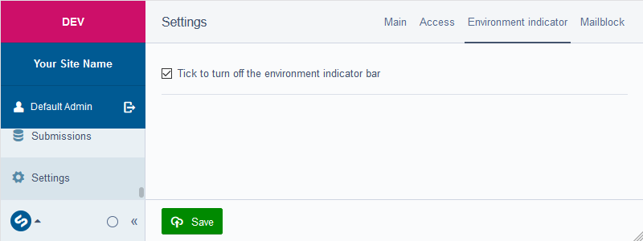
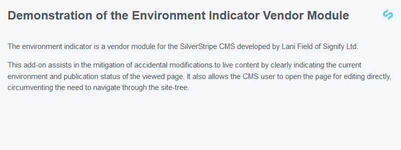
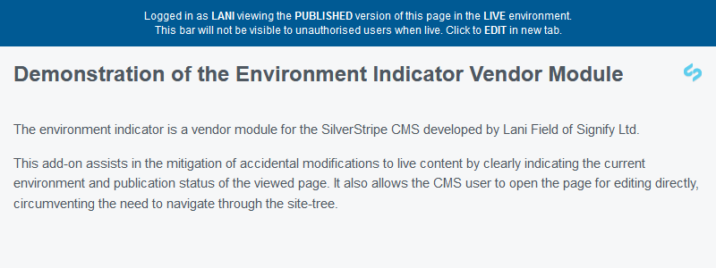
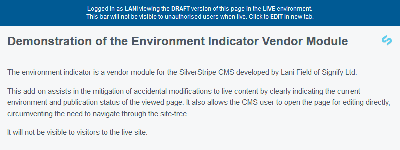
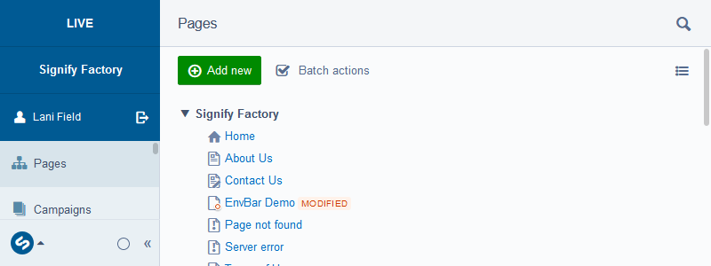
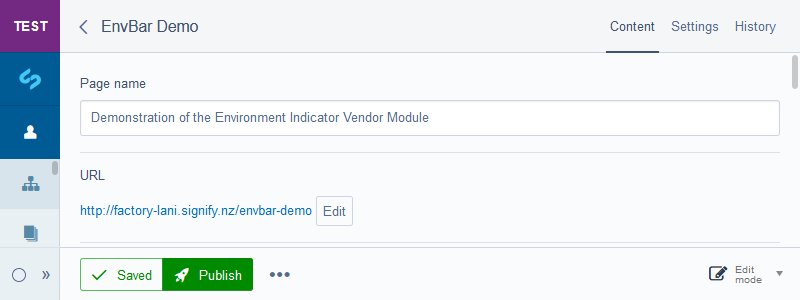
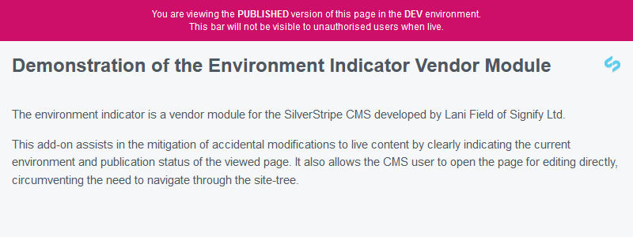
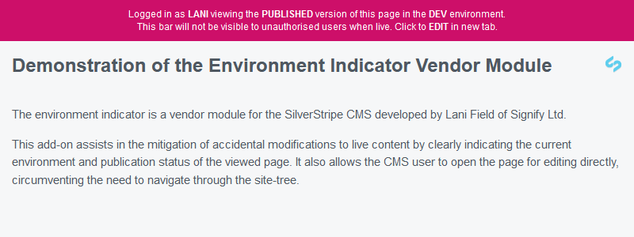
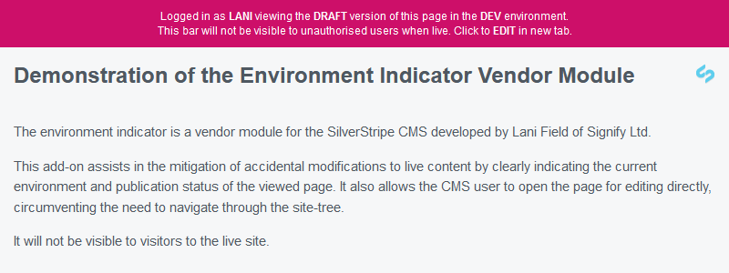
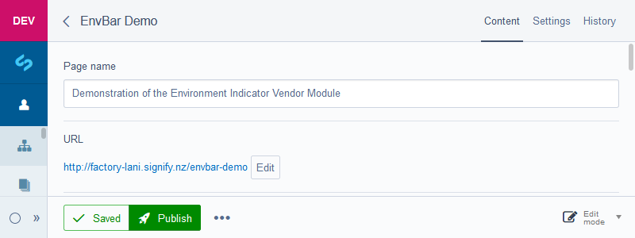

[](https://travis-ci.org/signify-nz/silverstripe-environmentindicator)
[](https://codecov.io/gh/signify-nz/silverstripe-environmentindicator)

# Environment Indicator

The Environment Indicator Vendor Module reads the SS_ENVIRONMENT_TYPE variable in your .env file (dev, test or live) and loads the applicable javascript to insert a custom div above the menu header in the CMS Admin interface.

The EnvBarExtension also inserts a custom element into the HTML of all pages to provide an information bar detailing the environment and page version. If the logged-in user has access to pages in the CMS, the bar acts as a link to open the page in the CMS via a new browser tab.

The bar does not appear in live mode for unauthorised users.

## Requirements

* [SilverStripe CMS ^4](https://github.com/silverstripe/silverstripe-cms)

## Installation

__Composer:__

```
    composer require signify-nz/silverstripe-environmentindicator
```

## Documentation

No further configuration is required, however customisation is optional.

### Developer

To disable the automatic placement of the bar as the first element of the body (if, for example, you have a fixed notification bar in your theme design), please add the following to a yml file in your site _config directory:

```yml
Signify\EnvBar\Extensions\EnvBarExtension:
  disable_auto_insert: true
```

You can then use the template variable `$EnvBar` in a more suitable position (recommended placement is in the Page.ss file or an include that is visible sitewide).

Customisation of the content and/or appearance can be achieved by editing the EnvBar.ss template or the envbar- .js and .css files. Functional tests are available in the tests directory. These will need to be updated if you modify the template.

* [Changelog](CHANGELOG.md)
* [Contributing](CONTRIBUTING.md)
* [Issues](https://github.com/signify-nz/silverstripe-environmentindicator/issues)
* [License](LICENSE.md)

## Usage

This module performs an informative function only.

There is a setting in the CMS to disable the bar from being visible on the frontend.

















